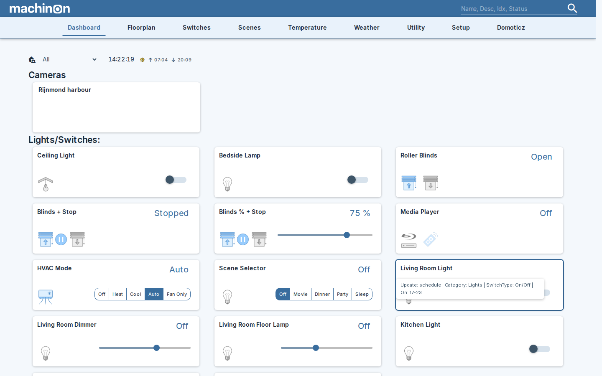
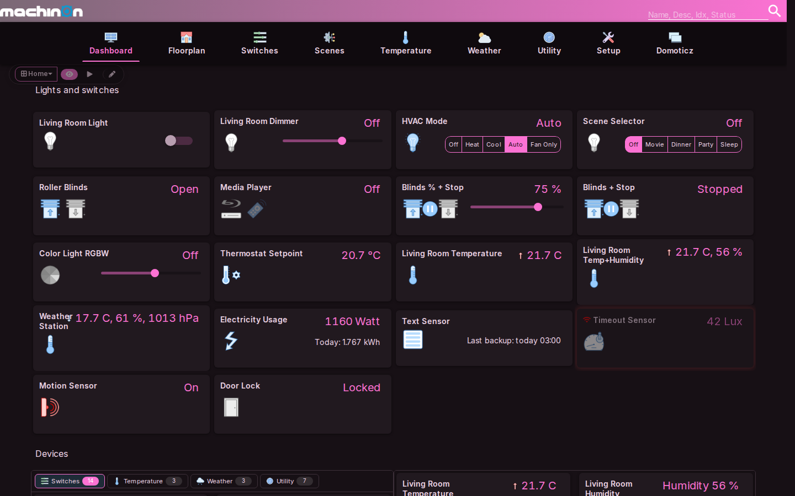
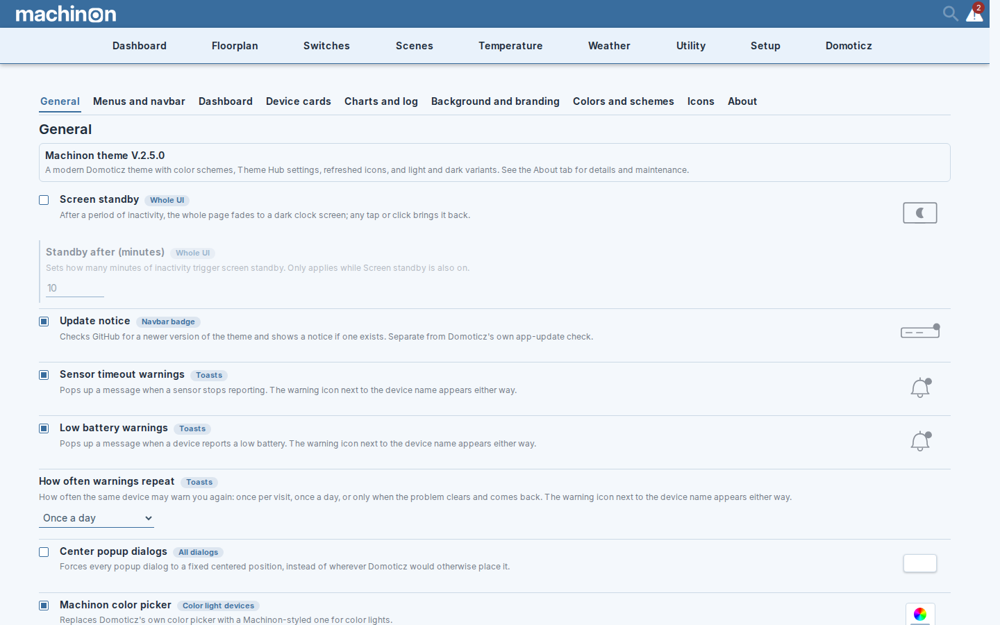
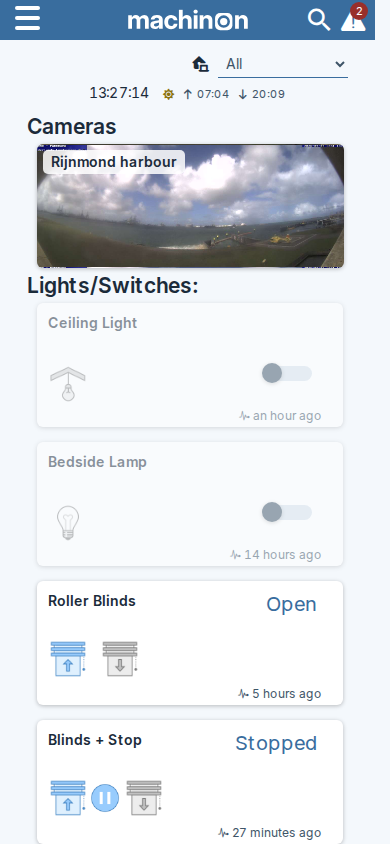
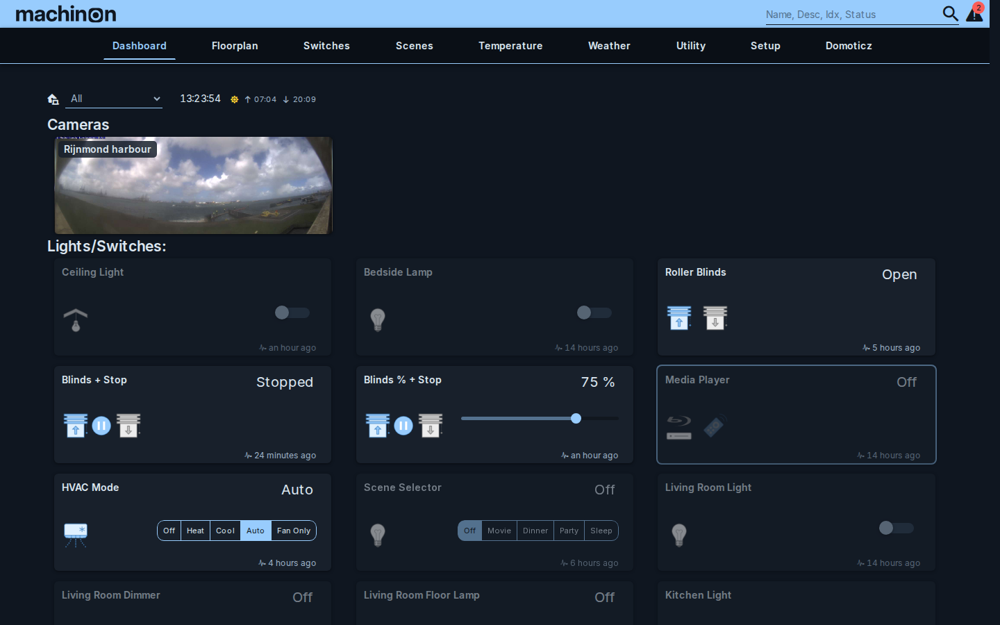
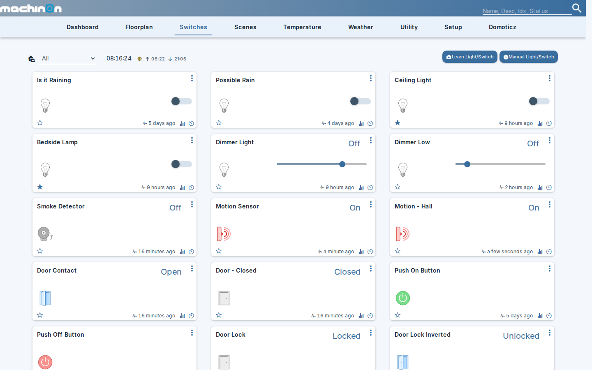
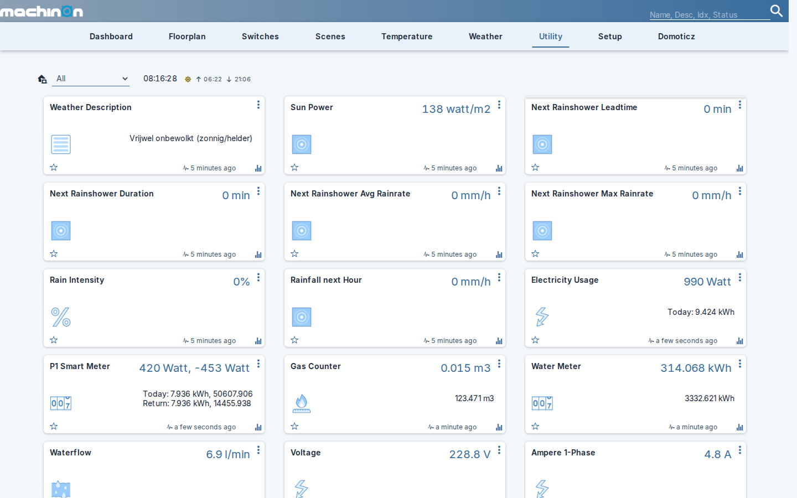
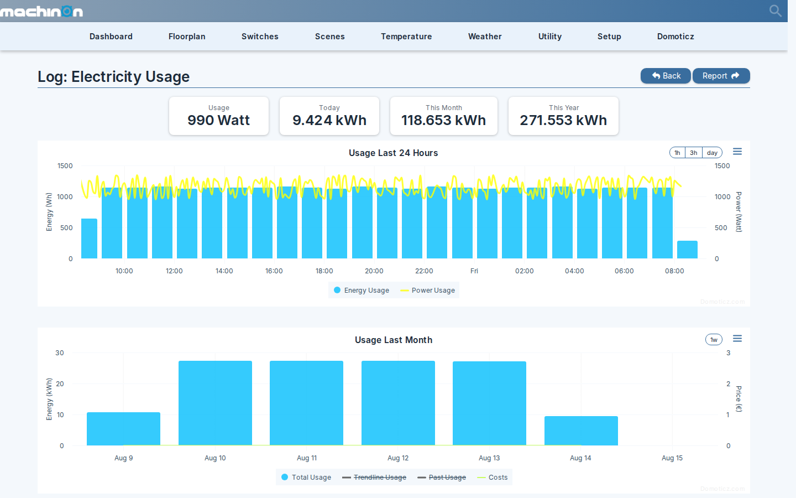

# Machinon

A modern, responsive theme for [Domoticz](https://www.domoticz.com/).




## What is Machinon

Machinon gives your Domoticz dashboard a clean, modern look, with matching light and dark modes, a choice of color schemes, a refreshed icon set, and one Theme Hub settings page inside Domoticz where you control all of it.

It works with current Domoticz beta and stable releases.

## Highlights

- **Color schemes**: Gruvbox, Magenta, and Paper, each with a light and dark variant, plus a custom color picker in the Theme Hub's "Colors and schemes" tab if you want to design your own palette and save it as a preset.

  

- **Theme Hub**: every theme setting lives on one dedicated settings page, reachable from Domoticz's Setup menu once the theme is active.

  

- **Refreshed icon set**: redrawn device icons with optional icon packs, so you can pick the style that suits your dashboard, installed straight from the Theme Hub's built-in pack installer.

  

- **Mobile-polished layouts**: dashboards, menus, and dialogs adapt to small screens instead of just shrinking the desktop layout.

  <details>
  <summary>Mobile dashboard</summary>

  

  </details>

- **Light and dark variants**: every color scheme ships both, so the whole interface follows your preference.

  

- **Fast loading**: releases are packaged so the theme loads quickly, especially on slower connections.

<details>
<summary>More screenshots</summary>


The Switches page, showing lights, sensors, and other on/off devices as cards.


The Utility page, listing counters and usage devices like electricity, gas, and water.


A device's Log page, charting electricity usage over the last 24 hours and the last month.

</details>

## Requirements

- A running Domoticz installation: Domoticz 2025.2 or newer, latest beta recommended. The theme is developed against the beta; on stable releases the Theme Hub menu entry is available to admin users.
- A browser you can hard-refresh (Ctrl+Shift+R) after installing or updating the theme.

## Installation

Pick one of the four options below. Option 1 is recommended for most users.

### Option 1: dist branch (recommended)

The leanest install: just the built theme, no source files.

```
cd domoticz/www/styles
git clone -b dist --single-branch https://github.com/domoticz/Machinon.git machinon
```

In Domoticz, go to Setup > Settings, open the System tab, and find the Theme dropdown under User Interface. Pick `machinon`, then click Apply Settings at the bottom of the page (the choice only persists once you do), and hard-refresh your browser (Ctrl+Shift+R) so it picks up the new files. No Domoticz restart is needed.

To update later, run `git pull` inside the `machinon` folder.

### Option 2: release zip

Download `machinon-<version>.zip` from the [GitHub Releases page](https://github.com/domoticz/Machinon/releases) and unzip it into `domoticz/www/styles/` (the zip already contains a `machinon/` folder, so you don't need to create one). Select the theme in Domoticz and hard-refresh your browser, as in Option 1.

To update, download and unzip the next release the same way.

### Option 3: Theme Manager plugin

The [Theme Manager plugin](https://github.com/galadril/domoticz-theme-manager) can install Machinon for you. It installs the full source repository rather than the lean dist build, so Option 1 loads faster if you don't need the plugin for other themes too.

### Option 4: full source (developers)

```
cd domoticz/www/styles
git clone https://github.com/domoticz/Machinon.git machinon
```

The source loads around 27 separate CSS files rather than one flattened file. That's fine for development, where you want to edit and reload individual files, but it's slower than the dist build for everyday use.

## Updating from 1.x

Machinon's repository history was rewritten for the v2.0.0 release. If you have a pre-2.0 clone, `git pull` inside it will fail because the histories no longer share a common base.

To update, delete the old `machinon` folder and reinstall using Option 1 or Option 2 above. Theme Manager (Option 3) installs are also git clones under the hood, so they break the same way; remove and reinstall through Theme Manager too.

Nothing needs migrating: all of your theme settings live in Domoticz itself and your browser, not in the theme folder, so a clean reinstall picks them up automatically. The in-app update notification links to the [Releases page](https://github.com/domoticz/Machinon/releases) whenever a newer version is available.

## Theme settings

Once Machinon is active, open the Theme Hub from the Domoticz Setup menu to configure it. From there you can choose a color scheme, set custom colors in the "Colors and schemes" tab, and turn individual features on or off.

This README only covers the basics. Deeper settings documentation is planned for a later update.

## Cache problems

Most issues after updating Domoticz or the theme go away after a hard refresh (Ctrl+Shift+R) or clearing your browser's cache. If you want a quick way to check whether caching is the culprit, open the site in an incognito or private window first.

## Contributing

See [CONTRIBUTING.md](CONTRIBUTING.md) for issue and contribution guidelines.

The theme's source CSS is modular, split into feature files under `css/` and assembled through a one-level `@import` rule (see the top of `custom.css`). Guard scripts under `scripts/` check things like token usage and typography, and CI runs them on every push. The styling itself is driven by a design-token system (the `--dz-*` custom properties) documented in [DESIGN.md](DESIGN.md).

## Credits and license

Machinon was originally created by [EdddieN](https://github.com/domoticz/Machinon) and is now maintained by the Domoticz community.

Icons by [Icons8](https://icons8.com); see [NOTICE](NOTICE) for full attribution. Fonts: Inter, JetBrains Mono, and Ionicons (see [NOTICE](NOTICE) for licenses).

Machinon is licensed under the GPL v3; see [LICENSE.txt](LICENSE.txt).
