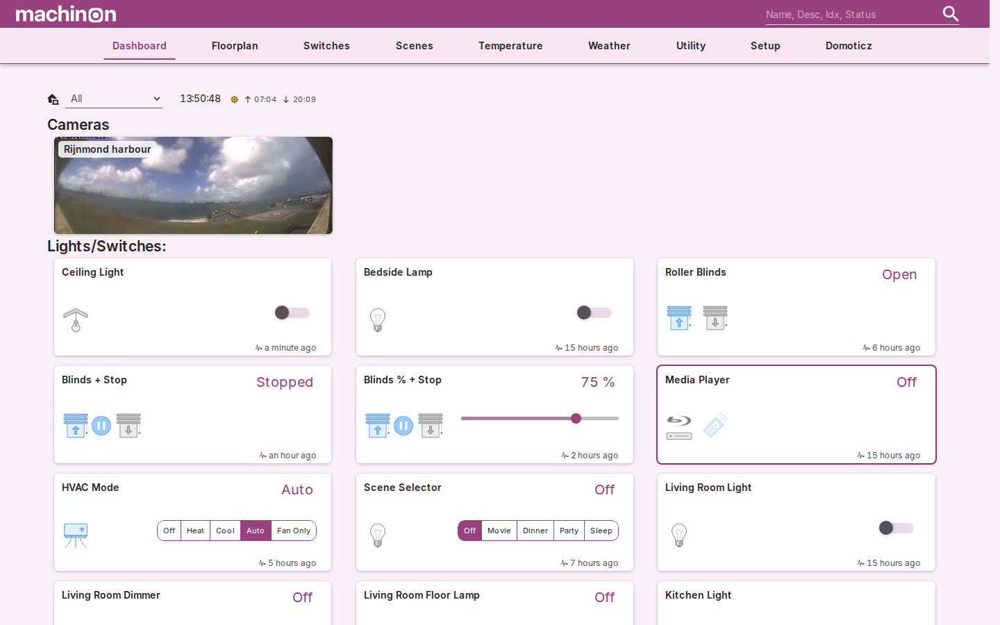
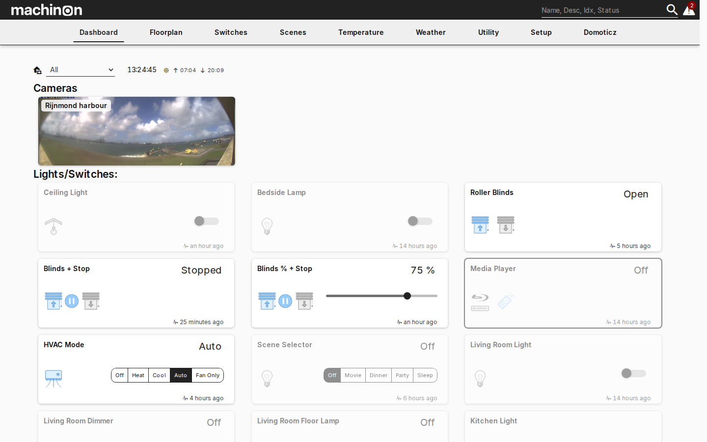
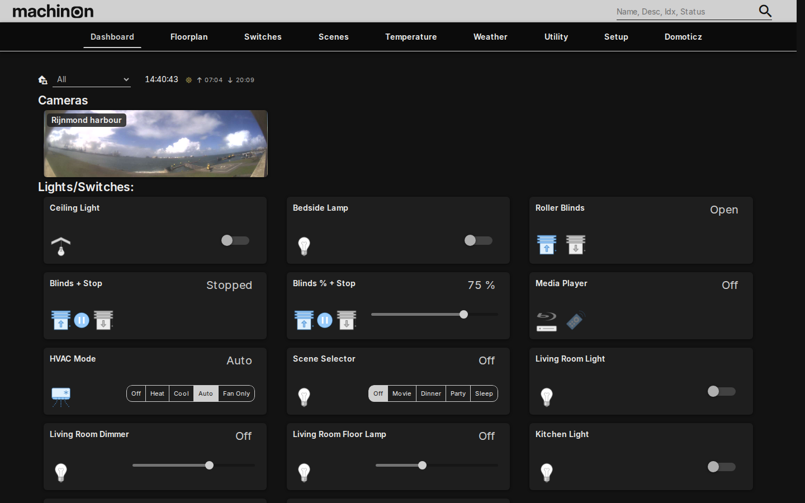
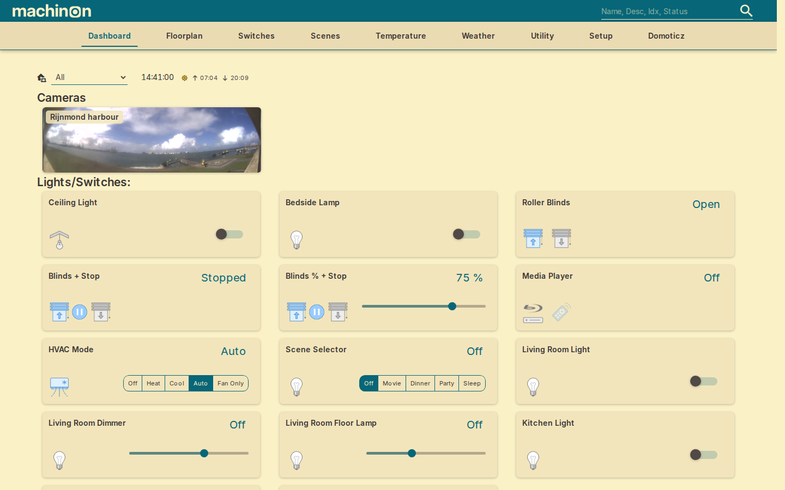
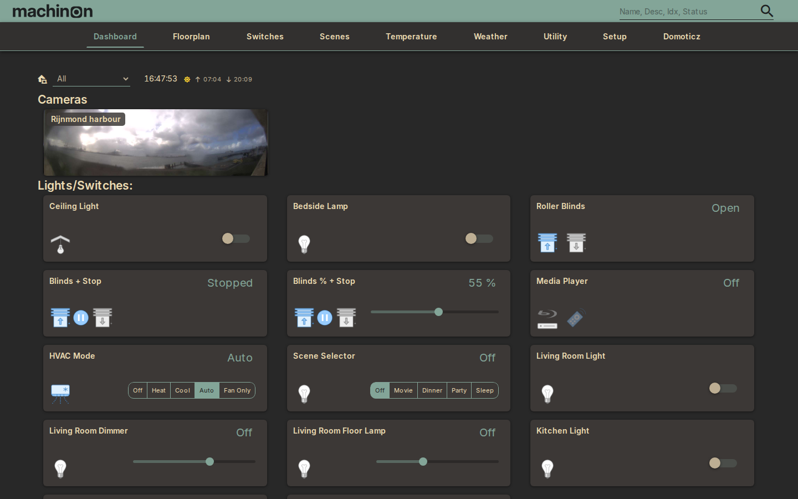

# Color schemes

Machinon ships eight color schemes, four light and four dark, and lets you build and save your
own on top of them. Every scheme lives on the Theme Hub's **Colors and schemes** tab.

## Picking a scheme

Open the Theme Hub (see [Theme Hub](theme-hub.md) if you haven't yet) and go to **Colors and
schemes**. Each scheme is shown as a card: a name, a short description, and a strip of seven
color swatches so you can see the palette before picking it. Click a card to apply it.

The choice takes effect immediately and is saved right away, there's no separate Apply or Save
step. It's a personal setting: on an installation with separate logins, your pick applies only to
your own account, and other users keep whichever scheme they last chose. See [Theme
Hub](theme-hub.md#personal-settings-versus-shared-settings) for how personal settings work if
your installation has no separate logins.

## The eight schemes

Two schemes are Machinon's own defaults and don't carry a color file of their own; the other six
are three color families, each with a light and a dark variant.

| Scheme | Variant | Description |
| --- | --- | --- |
| Machinon Light | Light | The default look: clean blue on white |
| Machinon Dark | Dark | The default look: blue glowing on navy |
| Magenta Light | Light | Warm magenta on white |
| Magenta Dark | Dark | Magenta glow on plum black |
| Paper Light | Light | Monochrome paper: zero-chrome interface, colour reserved for states |
| Paper Dark | Dark | Ink on slate: the monochrome pair of Paper Light |
| Gruvbox Light | Light | Warm retro paper |
| Gruvbox Dark | Dark | Retro warm dark with earthy accents |

## What each scheme looks like

Every screenshot is the same dashboard, so you can compare palettes rather than
layouts. Click any one to see it full size.

<figure markdown="span">
[{ width="1440" height="900" loading=lazy }](screenshots/dashboard-light.png)
<figcaption>Machinon Light</figcaption>
</figure>

<figure markdown="span">
[{ width="1440" height="900" loading=lazy }](screenshots/dashboard-dark.png)
<figcaption>Machinon Dark</figcaption>
</figure>

<figure markdown="span">
[{ width="1440" height="900" loading=lazy }](screenshots/dashboard-magenta-light.png)
<figcaption>Magenta Light</figcaption>
</figure>

<figure markdown="span">
[{ width="1440" height="900" loading=lazy }](screenshots/dashboard-magenta-dark.png)
<figcaption>Magenta Dark</figcaption>
</figure>

<figure markdown="span">
[{ width="1440" height="900" loading=lazy }](screenshots/dashboard-paper-light.png)
<figcaption>Paper Light</figcaption>
</figure>

<figure markdown="span">
[{ width="1440" height="900" loading=lazy }](screenshots/dashboard-paper-dark.png)
<figcaption>Paper Dark</figcaption>
</figure>

<figure markdown="span">
[{ width="1440" height="900" loading=lazy }](screenshots/dashboard-gruvbox-light.png)
<figcaption>Gruvbox Light</figcaption>
</figure>

<figure markdown="span">
[{ width="1440" height="900" loading=lazy }](screenshots/dashboard-gruvbox-dark.png)
<figcaption>Gruvbox Dark</figcaption>
</figure>

## Building your own colors

Click the **Custom** card, the last one in the list, to switch to your own palette. Once it's
selected, seven color swatches become editable. Each one paints a specific part of the
interface:

| Swatch | What it paints |
| --- | --- |
| Background | The page background behind everything else. |
| Menu | The top navigation bar, and any floating menu or dropdown that opens from it. |
| Item | The surface of cards and panels, the base color a device card sits on. |
| Main | The accent color: buttons, links, active states, and anything else that should draw the eye. |
| Text | The main body text color. |
| Secondary Text | Text that's meant to read as less prominent, such as labels and timestamps. |
| Disabled | Controls and text in a disabled or unavailable state. |

Click any swatch to open your browser's color picker and change it. Changes apply immediately,
so you can see the result as you go.

### Saving a custom palette as a preset

Once you're happy with a custom palette, click **Save as preset** and give it a name. It's added
to the scheme list as its own card, with a small "x" you can click to delete it later. Saved
presets are personal, the same as a built-in scheme pick: they follow the account that saved
them.

## The contrast warning

Every scheme that ships with Machinon holds body text against its background at WCAG AA contrast
or better, and text on accent-colored surfaces (like the text on a colored button) at 3:1 or
better. Those are the same minimums accessibility guidelines recommend for reading comfort.

Because a hand-picked custom color can't be checked before you pick it, Machinon checks it for
you: every time you change a custom swatch, or save one as a preset, it re-checks all three
pairs and shows a toast naming which pair failed and by how much if any of them fall short. The
color is still applied, and the preset still saves, the check warns rather than blocking you, so
you stay in control of the trade-off, you're just never left guessing that you made it.
