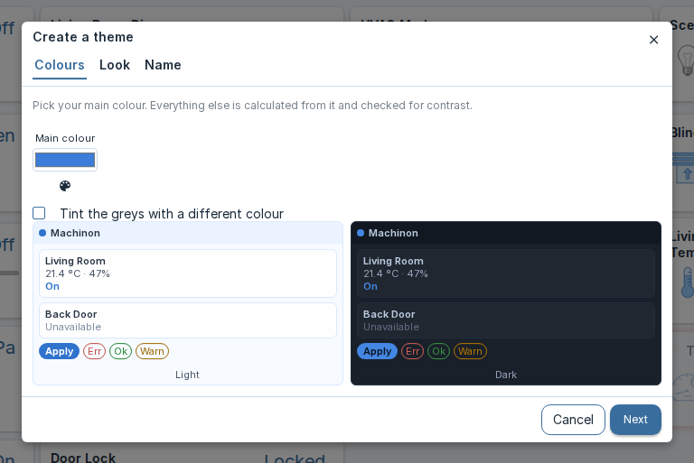
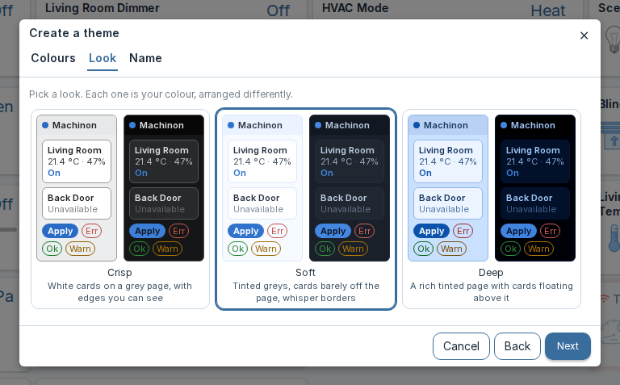
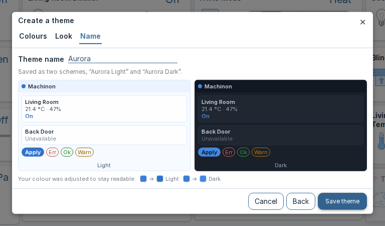

# Color schemes

Machinon ships eight color schemes, four light and four dark, and lets you build and save your
own on top of them. Every scheme lives on the Theme Hub's **Colors and schemes** tab.

## Picking a scheme

Open the Theme Hub (see [Theme Hub](theme-hub.md) if you haven't yet) and go to **Colors and
schemes**. Each scheme is shown as a card: a name, a short description, and a strip of seven
color swatches so you can see the palette before picking it. Click a card to apply it.

The choice takes effect immediately and is saved right away, there's no separate Apply or Save
step. It's a personal setting: on an installation with separate logins, your pick applies only to
your own account, and other users keep whichever scheme they last chose. See [Theme
Hub](theme-hub.md#personal-settings-versus-shared-settings) for how personal settings work if
your installation has no separate logins.

## The eight schemes

Two schemes are Machinon's own defaults and don't carry a color file of their own; the other six
are three color families, each with a light and a dark variant.

| Scheme | Variant | Description |
| --- | --- | --- |
| Machinon Light | Light | The default look: clean blue on white |
| Machinon Dark | Dark | The default look: blue glowing on navy |
| Magenta Light | Light | Warm magenta on white |
| Magenta Dark | Dark | Magenta glow on plum black |
| Paper Light | Light | Monochrome paper: zero-chrome interface, colour reserved for states |
| Paper Dark | Dark | Ink on slate: the monochrome pair of Paper Light |
| Gruvbox Light | Light | Warm retro paper |
| Gruvbox Dark | Dark | Retro warm dark with earthy accents |

## What each scheme looks like

Every screenshot is the same dashboard, so you can compare palettes rather than
layouts. Click any one to see it full size.

<figure markdown="span">
{ width="1440" height="900" loading=lazy }
<figcaption>Machinon Light</figcaption>
</figure>

<figure markdown="span">
{ width="1440" height="900" loading=lazy }
<figcaption>Machinon Dark</figcaption>
</figure>

<figure markdown="span">
{ width="1440" height="900" loading=lazy }
<figcaption>Magenta Light</figcaption>
</figure>

<figure markdown="span">
{ width="1440" height="900" loading=lazy }
<figcaption>Magenta Dark</figcaption>
</figure>

<figure markdown="span">
{ width="1440" height="900" loading=lazy }
<figcaption>Paper Light</figcaption>
</figure>

<figure markdown="span">
{ width="1440" height="900" loading=lazy }
<figcaption>Paper Dark</figcaption>
</figure>

<figure markdown="span">
{ width="1440" height="900" loading=lazy }
<figcaption>Gruvbox Light</figcaption>
</figure>

<figure markdown="span">
{ width="1440" height="900" loading=lazy }
<figcaption>Gruvbox Dark</figcaption>
</figure>

## Building your own colors

There are two ways to build a palette of your own. The theme wizard is the fast route: give it
one or two colors and a look you like, and it builds a finished pair of schemes for you. The
manual color editor is the slow route: every one of the seven swatches is yours to set by hand,
for when you already know exactly what you want. Neither one replaces the other, pick whichever
fits the moment.

### The fast way: the theme wizard

On the **Colors and schemes** tab, click **Create a theme**. A three-step dialog walks you
through it:

1. **Pick a color.** This becomes the theme's accent: buttons, links, and anything else that
   should draw the eye. You can also turn on a second color to tint the grays with, so the
   background and card surfaces pick up a hint of it. Only the second color's hue is used, not
   the exact shade, so it always blends in rather than clashing.
2. **Pick a look.** Three options, each showing you a live preview:

   | Look | What it looks like |
   | --- | --- |
   | Crisp | White cards on a light grey page, with edges you can see |
   | Soft | Tinted greys, with cards that barely lift off the page |
   | Deep | A richly tinted page with cards floating above it, and a near-black dark variant |

3. **Name it**, then click **Save theme**.

Behind the scenes, the wizard builds a full light theme and a full dark theme from your choices
and checks every color it generates for readability, so text stays easy to read wherever it
lands. Both new schemes are added to the picker above, and whichever one matches the mode
(light or dark) you're currently in is applied right away.

Both saved schemes are personal, the same as any other scheme pick: they follow the account that
saved them, and other people on the same Domoticz don't see them. You don't need admin rights to
create one. That's different from installing an icon, which changes the icon library for everyone
and is an administrator action (see [Icons](icons.md)). If your installation has no separate
logins, Domoticz can't tell users apart, so themes created there are shared like every other
setting; see [Theme Hub](theme-hub.md#personal-settings-versus-shared-settings).

<figure markdown="span">
{ width="768" height="513" loading=lazy }
<figcaption>1. Pick a color</figcaption>
</figure>

<figure markdown="span">
{ width="768" height="477" loading=lazy }
<figcaption>2. Pick a look</figcaption>
</figure>

<figure markdown="span">
{ width="768" height="450" loading=lazy }
<figcaption>3. Name it</figcaption>
</figure>

### Full creative control: the manual color editor

Click the **Custom** card, the last one in the list, to switch to your own palette. Once it's
selected, seven color swatches become editable. Each one paints a specific part of the
interface:

| Swatch | What it paints |
| --- | --- |
| Background | The page background behind everything else. |
| Menu | The top navigation bar, and any floating menu or dropdown that opens from it. |
| Item | The surface of cards and panels, the base color a device card sits on. |
| Main | The accent color: buttons, links, active states, and anything else that should draw the eye. |
| Text | The main body text color. |
| Secondary Text | Text that's meant to read as less prominent, such as labels and timestamps. |
| Disabled | Controls and text in a disabled or unavailable state. |

Click any swatch to change it. Alongside your browser's own color picker, Machinon offers a
color wheel and a box for typing a hex value directly, useful if you already know the exact
color you want or your browser's built-in picker is a limited one. The same wheel and hex box
are also available in the wizard's color step. Changes apply immediately, so you can see the
result as you go.

#### Saving a custom palette as a preset

Once you're happy with a custom palette, click **Save as preset** and give it a name. It's added
to the scheme list as its own card, with a small "x" you can click to delete it later. Saved
presets are personal, the same as a built-in scheme pick: they follow the account that saved
them.

## The contrast warning

Every scheme that ships with Machinon, and every scheme the theme wizard generates, holds body
text against its background at a comfortable reading contrast, and text on accent-colored
surfaces (like the text on a colored button) at a comfortable minimum too. Those are the same
minimums accessibility guidelines recommend for reading comfort, and the wizard checks its own
output against them before it ever shows you the result.

A palette you build swatch by swatch in the manual editor can't be checked before you pick it,
so Machinon checks it for you instead: every time you change a custom swatch, or save one as a
preset, it re-checks all three pairs and shows a toast naming which pair failed and by how much
if any of them fall short. The color is still applied, and the preset still saves, the check
warns rather than blocking you, so you stay in control of the trade-off, you're just never left
guessing that you made it.
