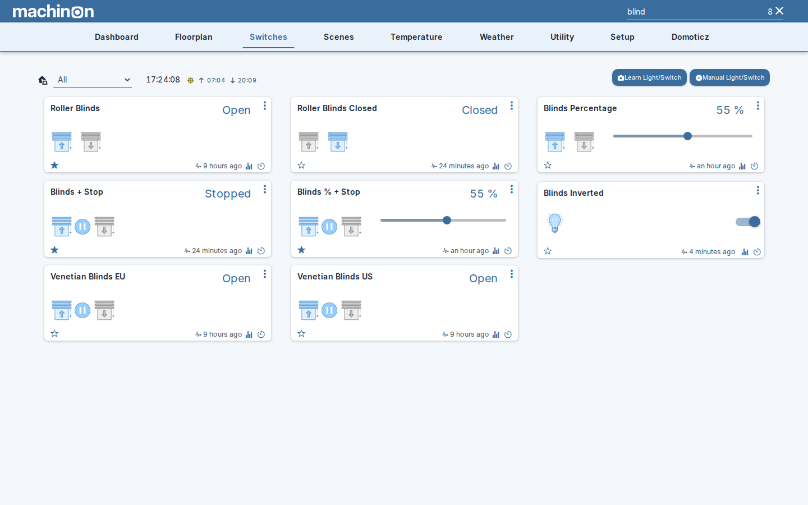

# Finding devices

Once you have more than a screenful of devices, scrolling stops being a good way to reach the
one you want. Machinon puts a search box in the top right of the header, next to the logo. Type
into it and the page narrows to the devices that match, live, as you type.

## Where you can search

The search box works on the pages that show devices as cards:

- **Dashboard** (on a computer; see [On a phone](#on-a-phone) below)
- **Switches**
- **Scenes**
- **Temperature**
- **Weather**
- **Utility**

On every other page there is nothing to filter, so the box dims and the typing area disappears,
leaving just the magnifier. That includes the Floorplan page, the Theme Hub, the Domoticz setup
pages, and [Problem devices](problem-devices.md), which is a list rather than a page of cards.

## What a search matches

A device matches if what you typed appears anywhere in:

- its **name**
- its **description**
- its **number**, the index Domoticz gives every device
- its **type**, such as Blinds or Temperature
- the **hardware** it comes from, as named on the Domoticz hardware page

Some pages match a little more: on Temperature and Weather the humidity description and the
forecast text count too, and on Switches a dimmer's percentage counts.

The box's placeholder text reads "Name, Desc, Idx, Status", which undersells it. Searching for
a device type or for the hardware a device belongs to works just as well, and is often the
fastest way to pull a whole family of devices onto one screen. Searching for `blind` on the
Switches page, as in the screenshot above, finds every blind whether or not the word appears in
its name.

## Searching for more than one word

On the Switches, Scenes, Temperature, Weather and Utility pages, and on the Dynamic Dashboard,
several words are treated as separate requirements that can appear **in any order**. Searching
for `living lamp` finds a device called "Living Room Floor Lamp", and so does `lamp living`.
You do not have to remember how the name was written.

The classic **Dashboard** is the exception. Domoticz searches that page itself rather than
handing it to the theme, and it looks for what you typed as **one phrase**. On the dashboard,
`living` finds everything in the living room, but `living lamp` finds nothing, because no device
is called exactly that. If a dashboard search comes up empty, try a single word.

## The match count, and clearing the search

While a search is active, the magnifier is replaced by two things: the number of matches, and a
**×** to clear the search. The number counts the cards on screen rather than distinct devices,
which matters on the classic dashboard, where one device can appear in two sections at once. A
weather station that shows up under both Temperature and Weather counts as two.

You can clear a search in three ways: click the count or the **×**, press Escape while the
box has focus, or simply delete what you typed.

Two shortcuts save reaching for the mouse: F3 or Ctrl+F anywhere on the page jumps
straight into the search box, and Enter closes the on-screen keyboard on a touch device
without clearing what you typed.

## The search stays as you move around

Moving to another page keeps your search term. If you search for `kitchen` on Switches and then
open Temperature, you are still looking at the kitchen. This is deliberate: walking one room's
devices across several pages is the common case, and having to retype the room on each page was
the old, slower behaviour.

The flip side is that a page can look emptier than it should because a search you forgot about
is still running. If devices are missing, check the search box first. The count beside it is
always visible when a search is active, including on a phone, precisely so you can spot this.

## Cameras on the dashboard

The camera previews on the classic dashboard are searched too, by camera name. Typing part of a
camera's name keeps that camera and hides the others. If nothing matches, the whole Cameras
section disappears rather than sitting empty above a filtered dashboard.

## On a phone

The box collapses to a magnifier in the header to save space, and expands into a floating field
when you tap it. See [Mobile layouts](mobile.md) for how the header behaves on small screens.

One difference worth knowing: the **Dashboard** is not searchable on a phone, because the phone
dashboard is a different, compact layout rather than the card grid the search filters. Switches,
Scenes, Temperature, Weather and Utility all search normally on a phone.

## See also

Searching narrows a page to what you typed. There is a second way to narrow a page, aimed at a
specific set of devices rather than a word: a warning about a timed-out sensor or a low battery
can filter the page to just the devices it names. See
[Problem devices](problem-devices.md).
