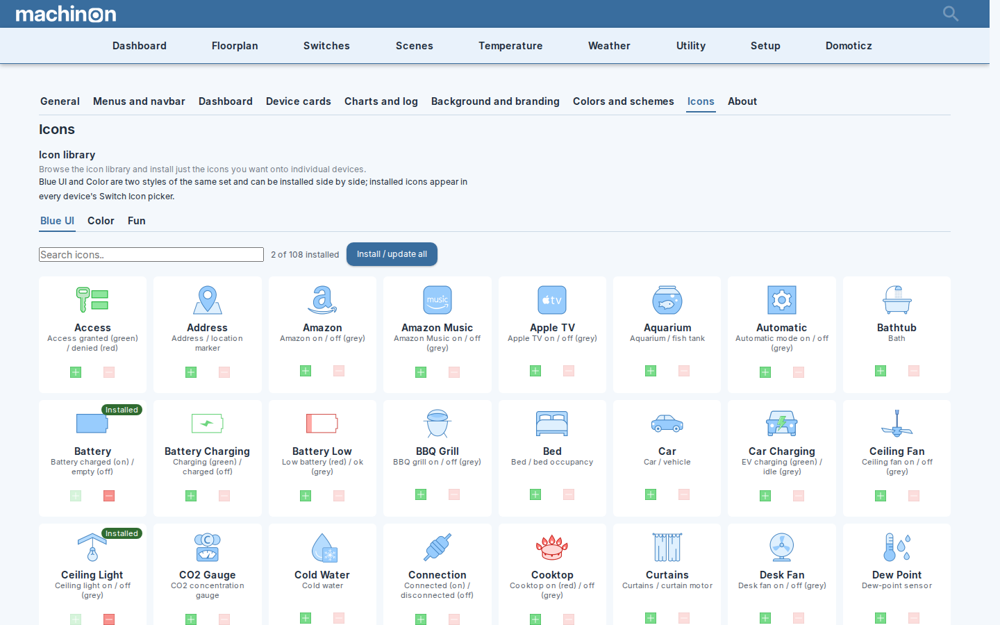

# Icon Library

Machinon ships a browsable library of over 250 device icons. You install only the ones you
actually want, one at a time, onto individual devices; everything else in your dashboard keeps
its existing icon.

## You need admin rights

Installing an icon changes it for everyone using this Domoticz, so it is an administrator action.
If your account is not an administrator, the **Icons** tab is not shown in the Theme Hub at
all: the rest of the hub works as normal, and the icons an administrator has installed still show
on your devices.

## The three tabs

Browse the library from the Theme Hub's **Icons** tab, which sorts icons into three tabs:

- **Blue UI**: a clean, flat, blue-tinted line style, and Machinon's own default look.
- **Color**: the same shapes as Blue UI, redrawn in fuller color, and the larger of the two
  matched styles. Blue UI and Color are a matched pair, most icons in the library ship in both.
- **Fun**: a smaller, more playful, novelty set for dashboards that want a lighter tone.

## On and off states

Every icon in the library has two pieces of art: one for when the device is on, one for when
it's off, which is why a light or switch actually looks different depending on its state. In the
icon browser, hover over an icon's preview to see its other state (tap it on a touchscreen); the
image swaps between the two so you can check both before installing.

## Installing an icon

1. Open the Theme Hub (see [Theme Hub](theme-hub.md)) and go to the **Icons** tab.
2. Pick a style tab (Blue UI, Color, or Fun), then browse or use the search box to find the icon
   you want.
3. Click the install button on its card. Once installed, the card is marked **Installed**, and
   the button switches to a remove action.

If a newer version of an icon you already installed becomes available, such as after a theme
update, its card stays marked **Installed**, but the install button turns into a blue refresh
button instead of staying disabled. Click it to reinstall the icon with the newer artwork; your
devices keep showing the older version until you do.

There's also an **Install / update all** button that installs (or refreshes) every icon
currently shown, useful if you've filtered down to a search result and want the whole set, or
to bring every outdated icon up to date at once.

!!! warning "This changes your Domoticz instance, not just the theme"
    Installing an icon does not stay inside Machinon's own settings. It writes the icon into
    Domoticz's own custom-icon library (the same one behind Setup > More options > Custom
    Icons), exactly as if you'd uploaded a custom icon there by hand. That means:

    - The icon stays installed even if you later switch away from Machinon to a different theme.
    - It's visible to, and usable by, every user of your Domoticz installation, not just you:
      this is the one part of the icon system that is never personal.
    - Removing an icon from the Theme Hub removes it from that same library. If any devices are
      using it, Machinon warns you which ones before removing it, and those devices revert to
      their default icon.

## Assigning an icon to a device

Installing an icon makes it available; it doesn't put it on a device by itself. To use it:

1. Open the device you want to change (its Edit dialog, from the Devices page or a card's edit
   button).
2. Find the **Custom Icon** or **Image** field and pick the icon you just installed from the
   list.
3. Save the device.

## Requesting a new icon

If the device or symbol you need isn't in the library, you can ask for it to be added by opening
a [new icon request](https://github.com/domoticz/Machinon/issues/new?template=icon_request.yml).
That link takes you straight to the request form instead of a blank issue.

The library is built from [Icons8](https://icons8.com) artwork. The library's Blue UI and Color icons
are drawn from two specific Icons8 styles: **Blue UI** (the source for the pack's Blue UI icons)
and **Office M** (the source for the pack's Color icons). The form asks for a link to the Icons8
icon you have in mind, and a request that links an icon already available in one of those two
styles can generally be added as-is; a request for a shape that only exists in another Icons8
style takes more work, since it first needs a matching Blue UI or Office M version to be found or
drawn. The form also asks whether the device has separate on and off states, whether it needs a
small inset badge (like the lightning bolt on an energy meter icon), and which color tint to use.
