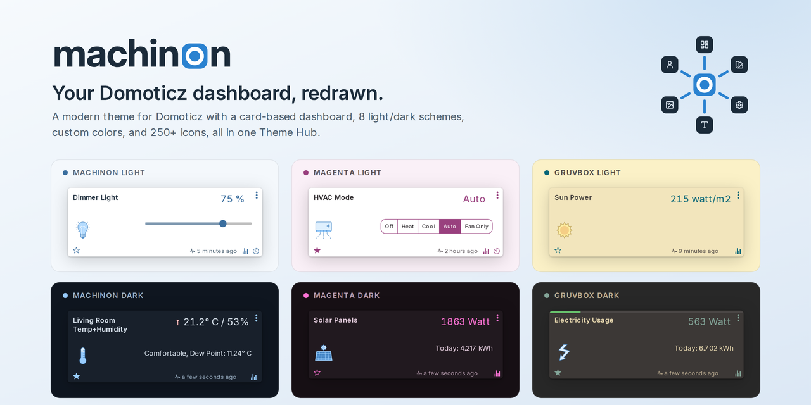

  

# Machinon

Machinon is a modern theme for [Domoticz](https://www.domoticz.com/). It gives your dashboard
a clean, card-based look, with matching light and dark modes, a choice of color schemes, a
refreshed icon set, and one settings page inside Domoticz, the Theme Hub, where you control all
of it.

See the [Machinon website](https://domoticz.github.io/Machinon/) for a live, interactive preview
of the color schemes and card layout; this manual covers installation and every setting in
detail.

## Highlights

- **Color schemes**: eight built-in schemes, each with a light and dark variant, plus a
  custom color picker if you want to design your own palette.
- **One settings page**: every setting lives in the Theme Hub, reachable from Domoticz's Setup
  menu once the theme is active.
- **Refreshed icons**: a library of over 250 device icons, installed one at a time
  onto individual devices from the Theme Hub.
- **Mobile-ready**: dashboards, menus, and dialogs adapt to small screens instead of just
  shrinking the desktop layout.
- **Search that finds things**: type in the header box and the page narrows as you type, matching
  a device's name, description, number, type or hardware. Several words count in any order, and
  the term follows you from page to page. See [Finding devices](finding-devices.md).
- **Problem alerts**: a warning icon in the header counts the devices that are timed out or low
  on battery, and disappears once none are. Click it, or open Problem Devices from the
  Setup menu, for the full list, each row showing an icon for the
  problem and when the device was last seen. See [Problem devices](problem-devices.md).
- **Fast to load**: releases ship as a single flattened stylesheet.

## Where to start

New to Machinon? Start with [Installation](installation.md) to get the theme running, then open
[Theme Hub](theme-hub.md) to see what you can configure and how those settings are shared (or
not) between users.
