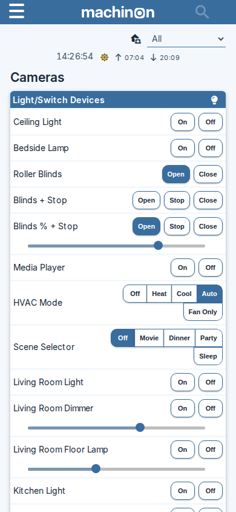
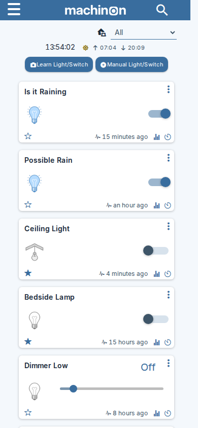
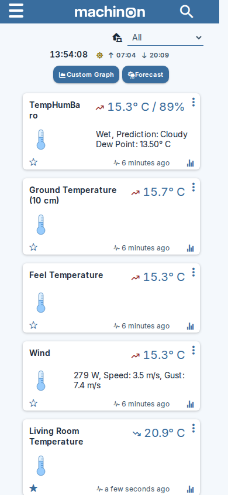
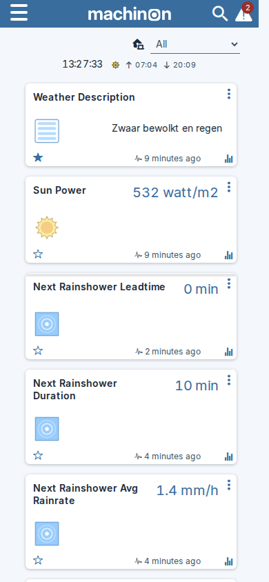
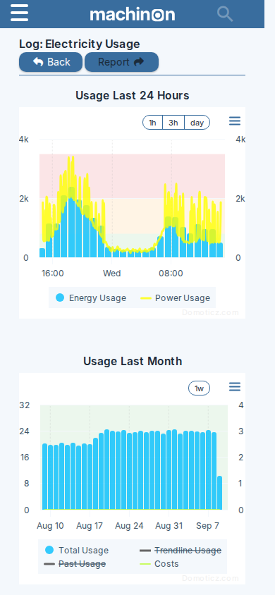

# Mobile layouts

Machinon adapts every page to smaller screens rather than just shrinking the desktop layout, and
it does that in two separate steps as the window narrows, not one. Widen or narrow your browser
window past 979 pixels and the navigation bar itself changes; keep narrowing past 767 pixels and
a further set of pages, forms and dialogs adapts on top of that. A tablet held between those two
widths sees only the first change, not the second, so which one applies to you depends on exactly
how narrow the screen is.

## The compact mobile dashboard

On a phone, Domoticz doesn't show you the same dashboard as on desktop, scaled down. It
automatically switches to its own compact mobile dashboard: your favourite devices, listed as
rows with their controls right beside them, so you can flip a switch or check a sensor without
opening the device.

Domoticz's compact mobile dashboard, which lists your favourite devices as rows with their
controls beside them. Domoticz picks this layout automatically on a phone.

The regular card dashboard is still there if you reach it another way, for example by widening
the window past the phone breakpoint or opening it on a tablet; on a narrow screen it stacks into
a single column instead of a grid.

The dashboard on a phone, with the cards stacked into a single column.

## Other pages on a phone

Every page in Domoticz gets the same mobile treatment, not just the dashboard: cards and tables
stack into a single column, and controls stay full-width and easy to tap.

The Switches page.

The Temperature page.

The Utility page.

A device's Log page, with the chart scaled to fit the screen.

## At 979px: the navigation bar switches

Once the window narrows past 979 pixels, the horizontal menu bar collapses into a hamburger icon
in the top-left corner, and pages that don't fit a narrow screen switch to a stacked,
single-column layout instead of trying to squeeze the desktop one down. This is the change a
tablet in portrait orientation typically sees.

Checked by resizing a browser against the running test instance: the full horizontal menu is
still showing at 980 pixels wide, and the hamburger icon has fully replaced it by 960 pixels
(the exact switch happens somewhere in between, at 979 pixels).

## At 767px: forms, tables, search and the Settings page adapt further

Narrower than 767 pixels, roughly phone width, a further set of changes kicks in on top of the
979px one above. A tablet that stays wider than this generally doesn't see this second set at
all.

- The search box collapses to a small icon and expands when you tap it, rather than sitting open
  in the navigation bar all the time. Checked live: the search box is still open (about 218
  pixels wide) at 768 pixels, and fully collapsed at 767.
- Tables inside dialogs wrap their text instead of running wide and needing to scroll sideways.
- Edit forms (for devices, and similar dialogs) stack each field's label above the field, instead
  of placing them side by side, so the field itself can use the full width.
- The Settings page's tile grid (the one behind the Setup menu) packs its icons into narrower
  tiles so more fit on screen; their labels stay put, just in a smaller tile. Checked live: the
  grid uses wide, three-per-row tiles at 768 pixels and switches to the narrower, five-per-row
  layout at 767.
- The Settings page's **Apply Settings** button also changes position here: instead of sitting at
  the top right next to the row of tabs (see [Troubleshooting and
  FAQ](troubleshooting-and-faq.md#the-theme-is-selected-but-nothing-changed) for where it
  normally is), it becomes a floating bar fixed to the bottom of the screen, so it stays reachable
  without scrolling back up.
