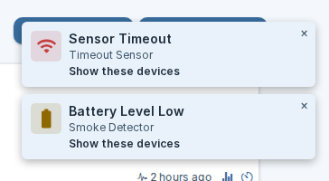
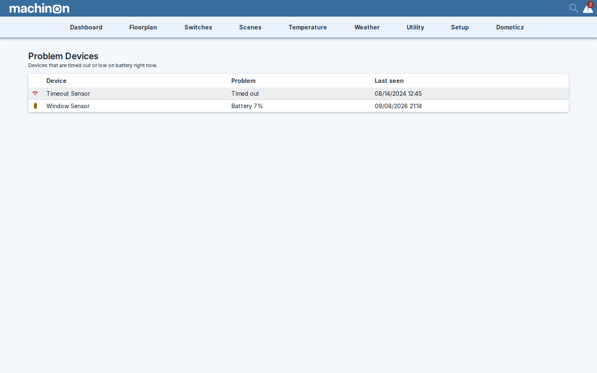

# Problem devices

Sensors go quiet and batteries run down, and both fail silently: nothing announces that the
freezer sensor stopped reporting three days ago. Machinon surfaces this in three places that all
show the same thing, so you can meet it wherever you happen to be looking:

- a **notification** when a card with a problem is on screen
- a **warning badge** in the header, counting the devices that currently have a problem
- a **Problem Devices page** listing all of them

## What counts as a problem

A device is listed when either of these is true:

- **It has timed out.** Domoticz has not heard from it for longer than the sensor timeout, which
  is a Domoticz setting rather than a theme one and defaults to 60 minutes.
- **Its battery is at 10% or below.**

Two kinds of device are never listed. A device that does not report a battery at all is not
treated as having an empty one, and a device whose hardware you have disabled in Domoticz is
left alone, since you already know it is not reporting.

## The warning notification

When a page shows a device with a problem, a notification appears in the corner naming it.
Several problems arriving together merge into one message rather than a stack, so you get
"3 devices low on battery" with the names listed under it, up to five, and "and 2 more" beyond
that.

The notification carries a **Show these devices** button. Clicking it filters the page down to
just the devices the message named, which is the quickest way to get from "something is wrong"
to the actual card. A small tag then appears, naming what you are looking at, with a **×** that
puts everything back. On a computer the tag sits just under the menu bar; on a phone it sits at
the bottom of the screen, out of the way of the header.

The filter belongs to the page you are on. Moving to another page clears it and the tag
disappears. If you leave the page before clicking **Show these devices**, the button just
dismisses the message, because the devices it names are no longer on screen.

Notifications disappear on their own after a few seconds, or stay while you hover over them.
Pressing Escape dismisses the most recent one.

## The warning badge in the header

The badge sits in the header and shows how many devices currently have a problem. It appears
only when that number is at least one and disappears by itself once everything is healthy, so
an empty header genuinely means nothing is wrong. It rechecks about once a minute, and pauses
while the tab is in the background.

Clicking it opens the Problem Devices page.

## The Problem Devices page

Each row tells you four things: an icon for the kind of problem, the device's name, what is
wrong with it (either "Timed out" or the battery percentage), and when it was last seen, as a
date and a 24-hour time.

Timed-out devices come first, then low batteries with the emptiest at the top, so the row that
needs you most is the row you read first.

Clicking a row takes you to the device on its own page, with the page already filtered to just
that device and the same clearing tag in place. Rows for devices that do not live on the
Switches, Temperature, Weather or Utility pages are not clickable, because there is no card page
to send you to.

The page lists the devices your Domoticz login can see, scoped the same way as the rest of the
Domoticz pages you use.

## Reaching the page

Three ways in, so it stays reachable when the badge is not there:

- Click the **warning badge** in the header, when devices have problems.
- Open the **Setup** menu in the navbar and choose **Problem Devices**, which sits just under
  Theme. With the theme's tile-grid settings menu turned on, the same entry appears as a tile.
- Go to `#/ProblemDevices` directly, if you want to bookmark it.

## Turning the notifications down

Three settings in the Theme Hub's **General** group control the notifications. They are personal
settings, so they follow your own login rather than changing what anyone else sees.

- **Sensor timeout warnings**, on by default.
- **Low battery warnings**, on by default.
- **How often warnings repeat**, which offers once per visit, once a day (the default), or only
  when something changes.

Turning these off silences the pop-up notifications only. The warning icon on the device's own
card stays, and so do the header badge and the Problem Devices page, so switching the
notifications off never hides a problem, it just stops interrupting you about it. All three are
described in the [Settings reference](settings-reference.md).

## See also

The **Show these devices** filter narrows a page to a specific set of devices. To narrow a page
by typing instead, see [Finding devices](finding-devices.md).
